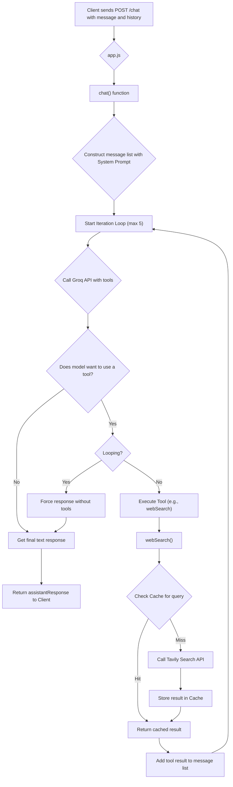
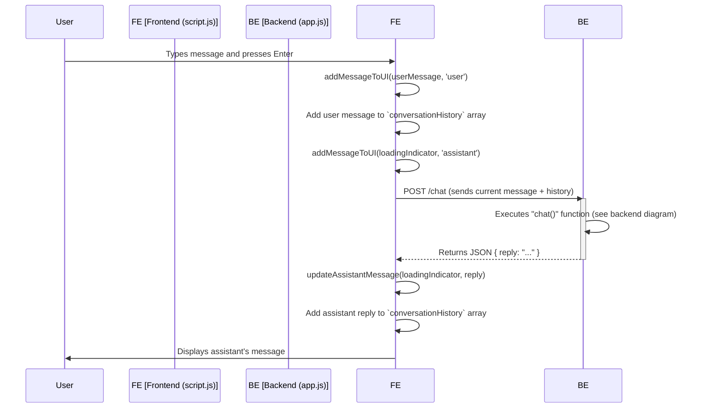

# 🤖 Namkeen AI Chatbot

Namkeen is a sophisticated, full-stack chatbot application featuring a responsive frontend and an intelligent, tool-wielding backend. Inspired by the user experience of modern AI assistants like ChatGPT, it provides a clean interface and powerful capabilities, including real-time web search.

The backend is built with Node.js and Express, powered by the Groq API for fast language model inference and the Tavily API for search. The frontend uses pure HTML, Tailwind CSS, and JavaScript for a lightweight, modern, and fully responsive user experience.


## ✨ Core Features

- **Responsive UI**: A clean, mobile-first chat interface that works beautifully on all devices.
- **Agentic Backend**: The AI can use tools to answer questions, such as performing a web search for up-to-date information.
- **Iterative Tool Use**: The AI can perform multiple tool calls in a sequence to gather sufficient information before answering.
- **Infinite Loop Prevention**: A built-in mechanism prevents the AI from getting stuck in repetitive tool-call loops.
- **Caching Layer**: Search results are cached to reduce API costs and provide near-instantaneous responses for repeated queries.
- **Stateless API**: The backend is stateless, with the frontend managing the conversation history for scalability.

## 🛠️ Tech Stack

- **Backend**:
  - **Node.js**: JavaScript runtime environment.
  - **Express.js**: Web framework for creating the API.
  - **Groq SDK**: For blazingly fast inference with Large Language Models.
  - **Tavily API**: For real-time, high-quality web search results.
  - **NodeCache**: For in-memory caching of search results.

- **Frontend**:
  - **HTML5**: The structure of the web page.
  - **Tailwind CSS**: A utility-first CSS framework for rapid UI development (used via CDN).
  - **JavaScript (ESM)**: For client-side logic, API communication, and DOM manipulation.

## 🏗️ Project Structure

```
g:/GenAI/
├── frontend/
│   ├── index.html      # Main HTML file for the chat interface
│   ├── script.js       # Client-side JavaScript for chat logic
│   └── style.css       # Custom styles for chat bubbles, scrollbars, etc.
├── node_modules/
├── .env                # Stores API keys and environment variables
├── app.js              # The Node.js/Express backend server
├── package.json
└── README.md           # You are here!
```

## ⚙️ How It Works: The Backend (`app.js`)

The backend is an Express.js server that exposes a single API endpoint: `POST /chat`. This endpoint is the brain of the operation, orchestrating the interaction between the user, the language model, and the available tools.

### Backend Workflow

The diagram below illustrates the logic flow within the `app.js` server for each incoming chat message.



### Key Backend Concepts

1.  **Agentic Loop**: The `while (iterations < maxIterations)` loop in the `chat` function is the core of the agentic behavior. It allows the model to make a decision, use a tool, see the result, and then decide on the next step. This process repeats until the model generates a final text answer or hits the iteration limit.

2.  **Loop Prevention**: The `toolCallTracker` is a simple but effective mechanism to prevent the model from getting stuck. Before executing a tool, it checks if the exact same function with the exact same arguments has been called too many times in the current turn. If a loop is detected, it breaks the cycle and forces the model to generate a text response based on the information it already has.

3.  **Caching**: The `webSearch` function first checks an in-memory `NodeCache` instance. If a result for the same search query exists and is not expired, it's returned immediately. This saves an API call to Tavily, reducing latency and cost.

## 🎨 How It Works: The Frontend (`frontend/`)

The frontend is responsible for rendering the chat interface and managing the user interaction. It's built to be simple, efficient, and stateless from the server's perspective.

### Frontend-Backend Interaction

This diagram shows how the frontend UI communicates with the backend server.



### Key Frontend Concepts

1.  **State Management**: The `conversationHistory` array in `script.js` is the single source of truth for the conversation. It's sent to the backend with every request, making the backend API stateless.

2.  **DOM Manipulation**: The `addMessageToUI` and `updateAssistantMessage` functions dynamically create and update HTML elements to display the conversation in real-time. This includes adding the user's message, showing a "typing" indicator, and finally rendering the assistant's response.

3.  **Asynchronous Communication**: The `sendMessage` function uses the `fetch` API to make an `async` call to the backend. The UI remains responsive while waiting for the server's response.

## 🚀 Getting Started

Follow these steps to get your own instance of Namkeen running locally.

### 1. Prerequisites

- Node.js (v18 or later recommended)
- `npm` (usually included with Node.js)

### 2. Installation

1.  Clone this repository or download the source code.
2.  Navigate to the project directory in your terminal:
    ```bash
    cd G:/GenAI
    ```
3.  Install the required Node.js dependencies:
    ```bash
    npm install
    ```

### 3. API Keys

You need API keys from Groq and Tavily for the application to work.

1.  Create a file named `.env` in the root of the project (`G:/GenAI/.env`).
2.  Add your API keys to this file:

    ```env
    # .env

    # Get your Groq API Key from https://console.groq.com/keys
    GROQ_API_KEY="gsk_..."

    # Get your Tavily API Key from https://app.tavily.com/
    TAVILY_API_KEY="tvly-..."
    ```

### 4. Running the Application

1.  Start the backend server from the root directory:
    ```bash
    node app.js
    ```
    For automatic restarts during development, you can use `nodemon`:
    ```bash
    nodemon app.js
    ```

2.  Once the server is running, you'll see a confirmation message:
    ```
    💬 Server listening on http://localhost:3000
    👉 Open http://localhost:3000 in your browser to start chatting.
    ```

3.  Open your web browser and navigate to `http://localhost:3000`. You can now start chatting with Namkeen!

---

*This README was generated with love by an AI assistant.*